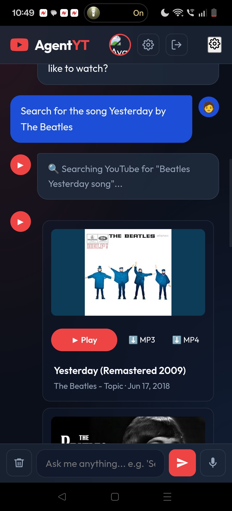
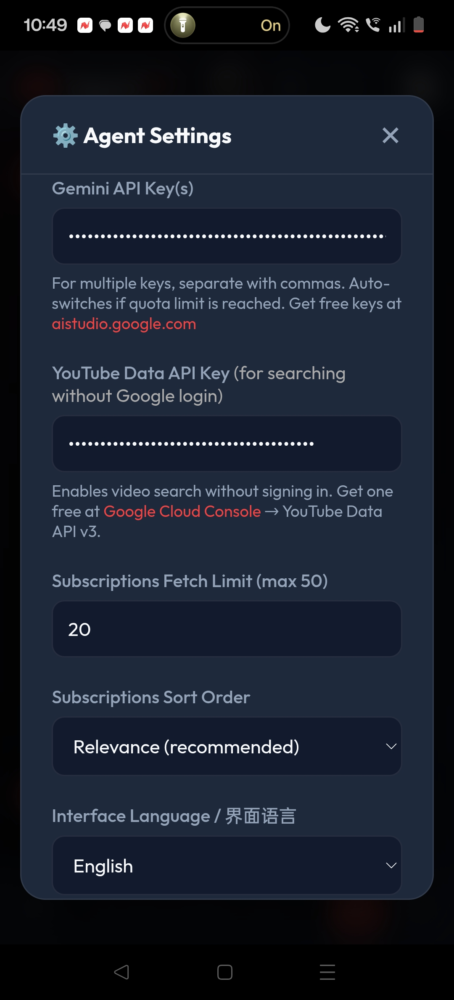

# AgentYT - AI-Powered YouTube Assistant 🤖📺

AgentYT is an intelligent, conversational web application that acts as your personal YouTube assistant. Powered by Google's Gemini 2.5 Flash, it allows you to search for videos, explore your subscriptions, and get recommendations using natural language.

## ✨ Features

- **Natural Language Search:** Just type what you want to watch (e.g., *"Search for the song Yesterday by The Beatles"*).
- **Subscription Insights:** 
  - *"Show me recent videos from MrBeast"* 
  - *"Which of my subscribed channels cover AI?"*
- **Bilingual Support (i18n):** Fully supports English and Chinese (中文) through auto-detection in chat and a UI toggle in Settings.
- **Smart Video Player:** Watch videos directly in the app. You can even ask the agent to "download" the video, which simulates a download flow.
- **Client-Side Only:** Runs entirely in the browser using the YouTube Data API v3 and Gemini API. 

## 📸 Usage Experience

Here is a preview of the AgentYT experience:

| 💬 Chat Initialization | 🤖 Agent Response & Search | ⚙️ API Configuration |
|:---:|:---:|:---:|
|  |  |  |
 

## 🚀 Setup & Installation

Since this is a client-side application, you don't need a backend server, but you must serve the files over a local web server to handle module loading and API requests securely.

1. **Clone the repository:**
   ```bash
   git clone https://github.com/xiaopao1990/AgentYT.git
   cd AgentYT
   ```

2. **Serve the project locally:**
   ```bash
   python3 -m http.server 8000
   ```
   *Then open `http://localhost:8000` in your browser.*

3. **Get your API Keys:**
   - **Google Gemini API Key:** Get a free key from [Google AI Studio](https://aistudio.google.com/app/apikey).
   - Add this key to the **Settings (⚙️)** menu inside the app.

## 🛠️ Technology Stack

- **Frontend:** Vanilla HTML5, CSS3 (Glassmorphism), JavaScript
- **AI Engine:** Google Gemini API (`gemini-2.5-flash` with Function Calling)
- **Data Integration:** Google Identity Services (OAuth 2.0), YouTube Data API v3

## 🔒 Privacy

All API keys are stored locally in your browser's `localStorage`. No data is sent to any servers other than directly to Google/YouTube APIs.
