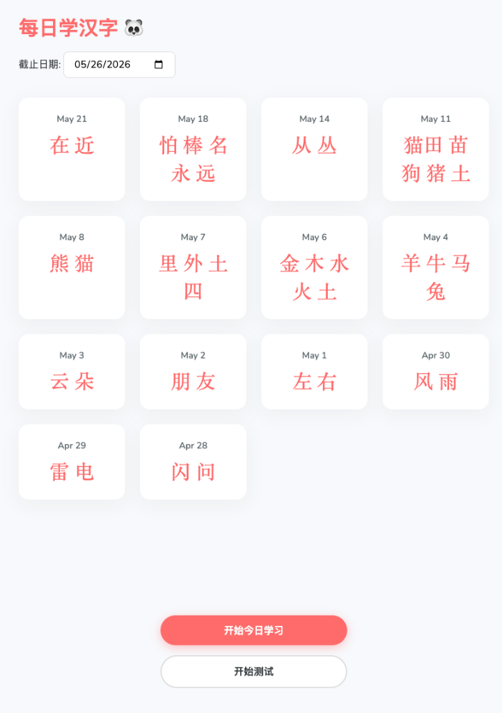
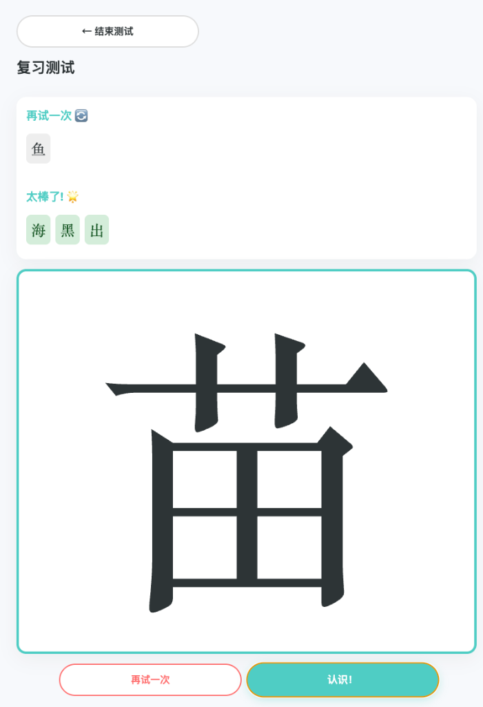

# Learn Chinese Daily 🐼

A fun, interactive, and responsive web application designed to help children learn and review simplified Chinese characters daily. 

## Features

- **Daily Learning Board**: A large interactive drawing board allowing kids to write Chinese characters using a mouse, stylus, or finger.
- **Smart Handwriting Recognition**: Automatically recognizes drawn characters using the Google Input Tools API, making it feel just like a native handwriting keyboard.
- **Review Mode (Tracing)**: Click on any past date in the dashboard to review. The character appears lightly in the background (as a stencil) so kids can practice tracing it.
- **Interactive Quiz Mode**: 
  - Choose how many past days you want to review.
  - Characters are shown one by one.
  - Sort them into **"Bingo! 🌟"** (remembered) or **"Try Again 🔄"** (needs practice).
  - Characters in the "Try Again" pile will reappear until every single character makes it to Bingo!
- **Serverless & Free**: Uses a Google Sheet as a database and Google Apps Script as the backend API. Completely free to host!

## Screenshots

### Dashboard


### Review Mode (Tracing)


### Quiz Mode


## Architecture

- **Frontend**: Vanilla HTML5, CSS3, and JavaScript. Fully responsive for phones and iPads.
- **Backend API**: Google Apps Script (`backend.gs`).
- **Database**: Google Sheets.
- **Hosting**: Firebase Hosting (or any static host).

## Setup & Deployment Instructions

### 1. Set up the Database (Google Sheets)
1. Go to your Google Drive and create a new **Google Sheet**.
2. Rename the first tab to `LearningRecords`.
3. In row 1, add headers: Cell A1 `Date`, Cell B1 `Characters`.

### 2. Set up the Backend (Apps Script)
1. In your Google Sheet, click **Extensions > Apps Script**.
2. Delete the default code and paste the entire contents of `backend.gs` from this repository.
3. Click **Deploy > New Deployment**.
4. Select **Web app**.
   - **Execute as**: `Me`
   - **Who has access**: `Anyone`
5. Click **Deploy**. Authorize the permissions if prompted.
6. **Copy the resulting Web App URL**.

### 3. Connect the Frontend
1. Open `app.js` in this repository.
2. At the very top of the file, replace `<YOUR_GOOGLE_SCRIPT_URL>` with the URL you just copied:
   ```javascript
   const SCRIPT_URL = 'https://script.google.com/macros/s/.../exec';
   ```

### 4. Run or Host the App
- **Local**: Simply double-click `index.html` to run it in your browser.
- **Firebase**: Run `firebase deploy` to host it live on the web!

## License
Open Source. Feel free to fork and modify!
