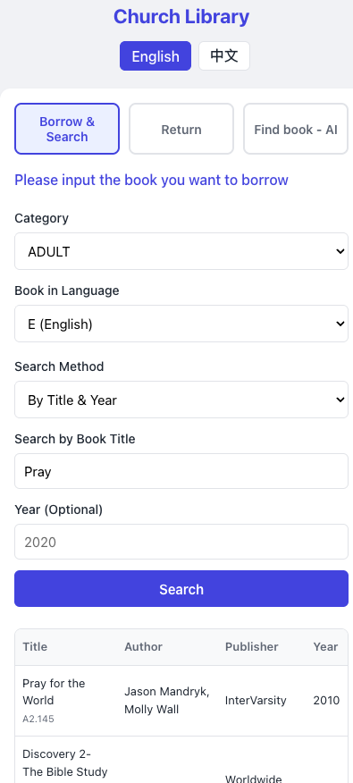

# Church Library Self-Service System 📚

A modern, responsive React + Vite self-service application for church libraries. Patrons can easily search the catalog, borrow books, return books, and get AI-powered semantic book recommendations using Gemini.

---

## 🚀 Key Features

*   **Self-Service Borrowing:** Fast book lookup by Call Number, Title, or Year with easy digital checkouts.
*   **Patron Self-Returns:** Quick search of active borrows by Borrower Name/Book Title or Call Number to process returns seamlessly.
*   **AI Book Assistant:** Semantic search (RAG) using Gemini to ask the AI librarian for recommendations (e.g., "books about spiritual growth").
*   **Google Sheets Backend:** Lightweight setup using Google Apps Script acting as the database, logging and updating spreadsheet records in real-time.

---

## 📸 Usage Screenshots

Here is the system in action:

### 🔍 Book Search & Catalog
Patrons can search the database dynamically and start checkout flows in English or Chinese.

### 🤝 Checkout & Return Confirmations
Secure confirmations ensure data accuracy and remind patrons where to place physical returned books.

### 🤖 AI Librarian (Gemini-Powered)
Get instant semantic recommendations and next-page pagination options for matching titles in the catalog.

---

## 🛠️ Tech Stack & Setup

*   **Frontend:** React, Vite, Vanilla CSS
*   **Backend Database:** Google Sheets & Google Apps Script
*   **AI Engine:** Gemini API (`gemini-flash-latest` & `gemini-embedding-001`)

### Setup Instructions
1.  **Backend (Google Sheets):** Deploy the Google Apps Script in [apps-script.js](file:///Users/xiong/Desktop/libraryTool/apps-script.js) and [ai-engine.gs](file:///Users/xiong/Desktop/libraryTool/ai-engine.gs) as a Web App.
2.  **App configuration:** Add your deployed Web App URL in [App.jsx](file:///Users/xiong/Desktop/libraryTool/src/App.jsx) (replace `YOUR_GOOGLE_APPS_SCRIPT_WEB_APP_URL_HERE`).
3.  **Local Dev:** Run `npm install` and `npm run dev` to launch the client interface.
