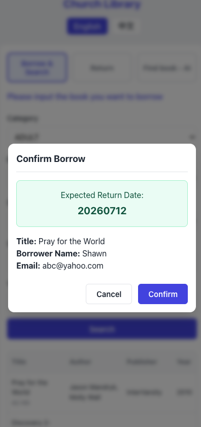
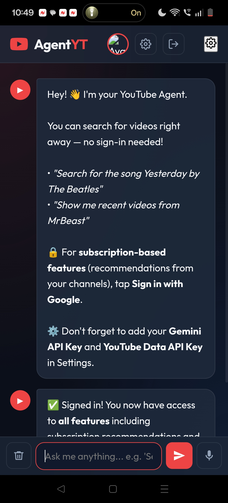
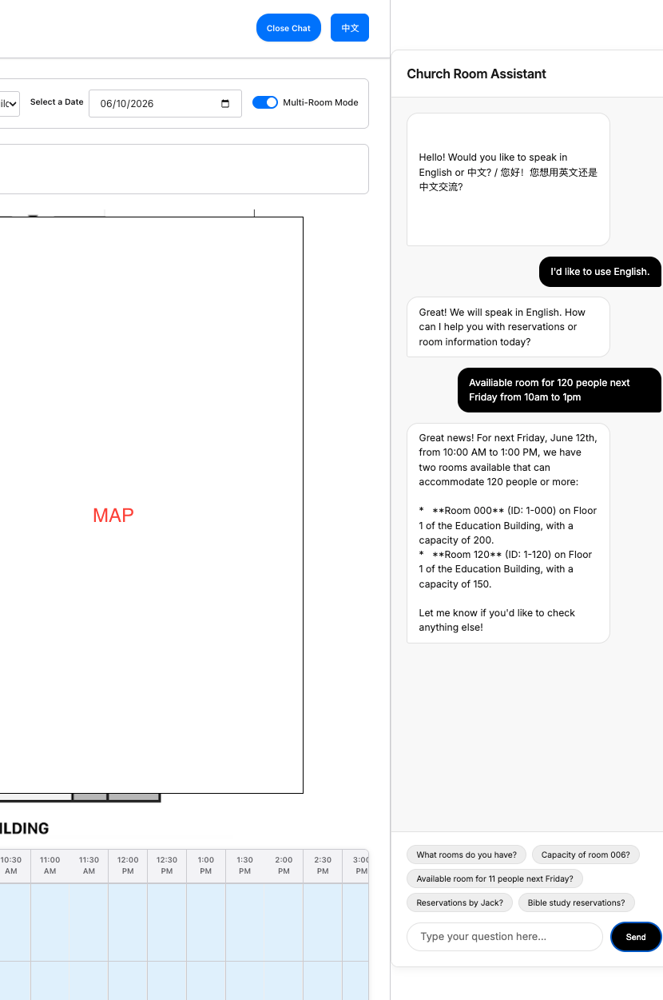
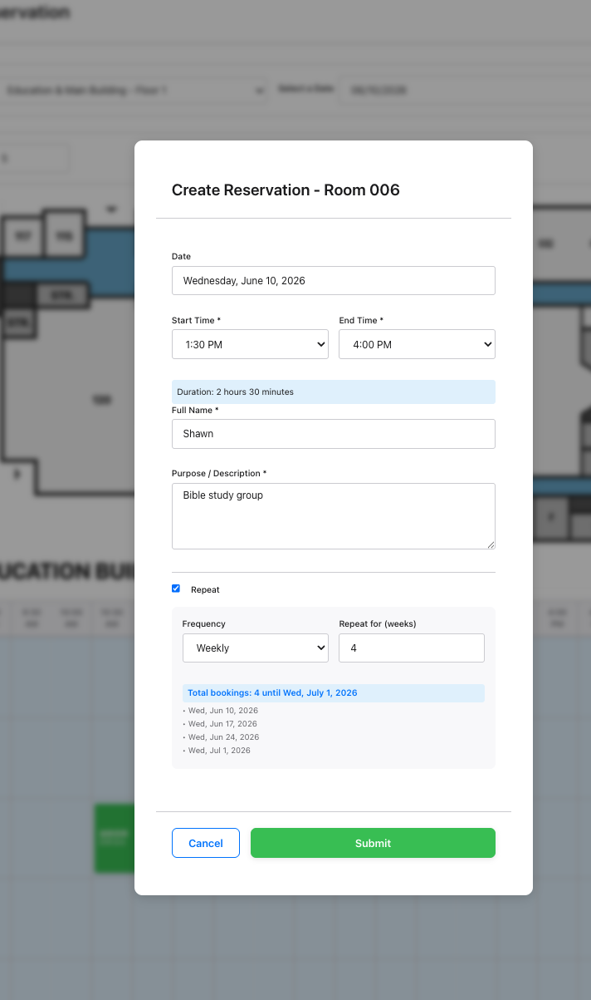

# Hi there, I'm xiaopao1990 👋

Welcome to my GitHub profile! Below is a showcase of personal active AI projects, featuring full self-service systems, AI-powered conversational tools, interactive educational apps, and database integrations.

---

## 🚀 Projects Showcase

### 1. Church Library Self-Service System 📚
> 🔗 [View Repo](https://github.com/xiaopao1990/LibSelfServiceTool)

A responsive React + Vite self-service kiosk system designed for church libraries. Patrons can easily search the catalog, borrow books, process returns, and receive AI-powered semantic recommendations.

**Key Features:**
- 📖 **Self-Service Borrowing & Returns** — Quick lookup by Call Number, Title, or Borrower Name to submit transactions
- 🤖 **Gemini AI Assistant** — RAG-powered semantic search answering queries like *"books about spiritual growth"* based on the live catalog
- 📊 **Google Sheets Backend** — Uses Google Sheets as a database and Google Apps Script as the API for real-time updates

**Screenshots:**

| 🔍 Book Search & Catalog | 🤝 Confirm Return | 🤖 AI Librarian |
|:---:|:---:|:---:|
|  |  |  |

---

### 2. AgentYT — AI-Powered YouTube Assistant 🤖📺
> 🔗 [View Repo](https://github.com/xiaopao1990/AgentYT)

An intelligent, conversational web app that acts as your personal YouTube assistant, leveraging Gemini 2.5 Flash to search for videos, explore subscriptions, and provide personalized suggestions in natural language.

**Key Features:**
- 💬 **Natural Language Search** — Search videos and query subscription activity through conversation
- 🌐 **Bilingual Chat Engine (EN/中文)** — Auto-detects language and adapts the AI responses and UI accordingly
- ▶️ **In-App Video Player** — Watch YouTube content inside a custom viewport without leaving the app

**Screenshots:**

| 💬 Chat Initialization | 🤖 Agent Response & Search | ⚙️ API Configuration |
|:---:|:---:|:---:|
|  |  |  |

---

### 3. Learn Chinese Daily 🐼
> 🔗 [View Repo](https://github.com/xiaopao1990/LearnChineseCharactorForKids)

A fun, interactive, and mobile-responsive web application designed to help children learn, write, and review simplified Chinese characters daily.

**Key Features:**
- ✏️ **Interactive Writing Board** — Large drawing canvas optimized for mouse, stylus, or touch input
- 🔍 **Handwriting Recognition** — Integrates Google Input Tools API to recognize handwritten strokes in real-time
- 🧠 **Review & Quiz Modes** — Tracing mode stencils previous characters; Quiz mode tracks mastered characters using a "Bingo" pile

**Screenshots:**

| 🗓️ Dashboard | ✏️ Review Mode (Tracing) | 🧠 Quiz Mode |
|:---:|:---:|:---:|
|  |  |  |

---

### 4. 4C Room Reservation AI Assistant ⛪🤖
> 🔗 [View Repo](https://github.com/xiaopao1990/room-reservation-AI-tool)

A bilingual (English/Chinese) AI scheduling assistant that wraps around the 4C Church Room Reservation System, providing natural language access to room availability and booking slots.

**Key Features:**
- 🗂️ **Integrated Sidebar Widget** — Animated slide-in interface that dynamically shifts the main page content
- 🔄 **ReAct Agent Pattern** — Gemini 1.5 Flash calls real-time Firestore tools to check room capacity and conflicts
- 🔒 **Secure Session Auth** — Integrates with the existing web app's passcode session cookie

**Screenshots:**

| 🤖 AI Sidebar View | 📅 Booking Grid | 📋 Reservation Table |
|:---:|:---:|:---:|
|  |  |  |

---
