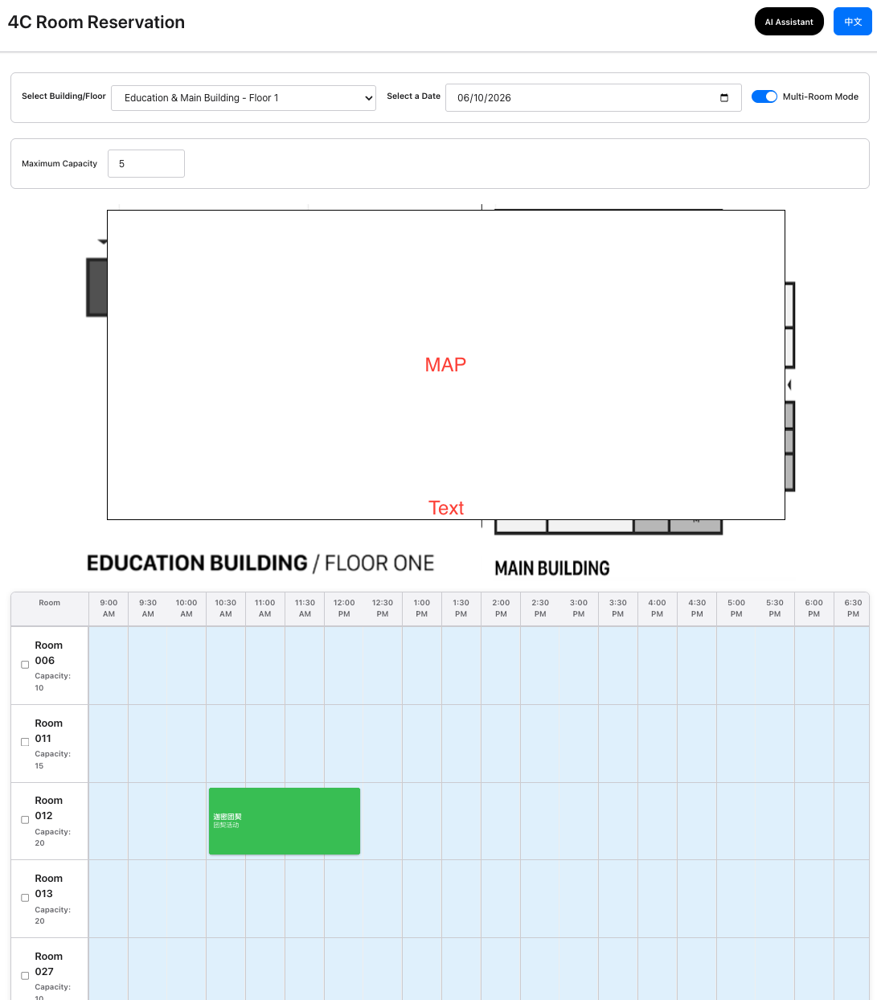

# 4C Room Reservation AI Assistant ⛪🤖

A bilingual (English/Chinese) AI-powered reservation assistant for the 4C Church Room Reservation System. This tool provides a toggleable sidebar for desktop users to query room availability, capacity, and current reservations using natural language.

## 🌟 Key Features

- **Integrated AI Sidebar**: A sleek, animated sidebar that slides in on desktop and tablet views while shifting the main site content.
- **Bilingual Conversations**: Support for both English and Chinese with an intuitive language picker.
- **Unified Authentication**: Shares the same passcode-protected session as the main reservation dashboard.
- **AI Agent (ReAct Pattern)**: Uses Google Gemini 1.5 Flash to intelligently lookup rooms, check capacities, and answer specific reservation questions.
- **Safety & Rate Limiting**: 
  - **Quota**: 7 questions per session followed by a 5-minute cooldown.
  - **anti-spam**: 5-second mandatory delay between questions.

## 🛠️ Technical Stack

- **Frontend**: HTML5, Vanilla JavaScript, CSS3 (Modular Layout).
- **Backend**: Python 3.12 Cloud Functions (2nd Gen) with FastAPI for routing.
- **Database**: Google Cloud Firestore (leveraging the Church's existing room data).
- **AI Engine**: Google Gemini 1.5 Flash.
- **Deployment**: Firebase Hosting & Cloud Functions.

## 🚀 Deployment Instructions

### Prerequisites
- [Firebase CLI](https://firebase.google.com/docs/cli) installed.
- Access to the `crr-38ff7` Firebase project.

### 1. Set the Gemini API Key
The AI requires a valid Google Gemini API Key. Set this securely in Firebase Secret Manager:
```bash
firebase functions:secrets:set GEMINI_API_KEY
```

### 2. Deploy to Production
To push both the frontend UI and the backend AI function:
```bash
firebase deploy
```
To deploy only the frontend UI:
```bash
firebase deploy --only hosting
```
To deploy only the AI backend:
```bash
firebase deploy --only functions
```

### 3. Local Testing
To test the web interface locally:
```bash
npx -y serve public -l 8083
```
Visit `http://localhost:8083`. Note: AI features require communication with the live Firebase Functions unless the Firebase emulator is running.

## 📁 Repository Information
- **Owner**: 4cMT
- **Template Source**: `room-reservation-AI-tool`
- **GitHub**: https://github.com/4cMT/room-reservation-AI-tool.git

## 📸 Usage Examples

Below are screenshots demonstrating the usage of the AI assistant:

### 1. AI Assistant Sidebar View


### 2. Booking View


### 3. Room Reservation Table


---
*Created with 💙 for 4C Church*
